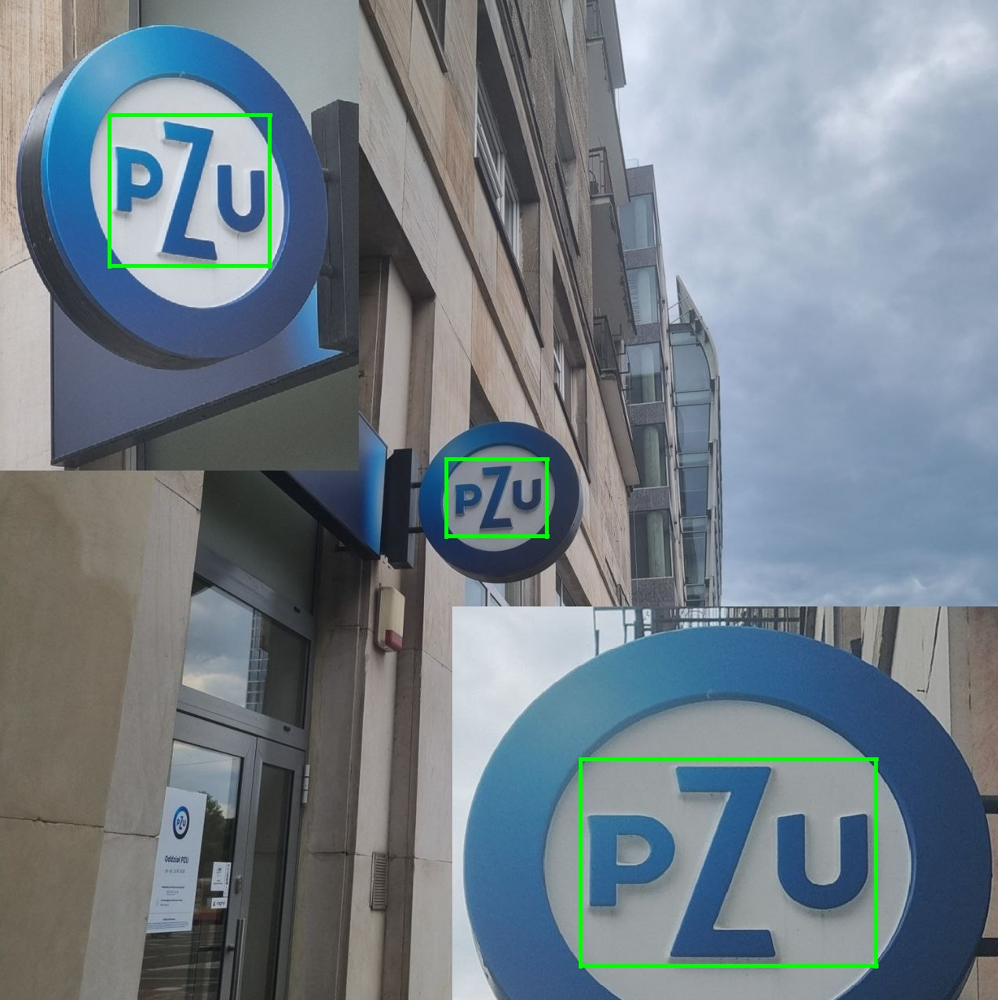

# POBR Projekt

## Detekcja loga PZU / PZU company logo detection
--PL--
Opis znajduje się w pliku sprawozdanie_z_projektu.pdf

--ENG--
This application's task was to recognize PZU company logo in realistic (not artificially generated) photos. Whole project uses C++ as a programming language and OpenCV data structures. Algorithms used to change image values were implemented from scratch. It consists of programs for:
- preprocessing
- filtering
- segmentation
- detection and recognition

Few examples:

